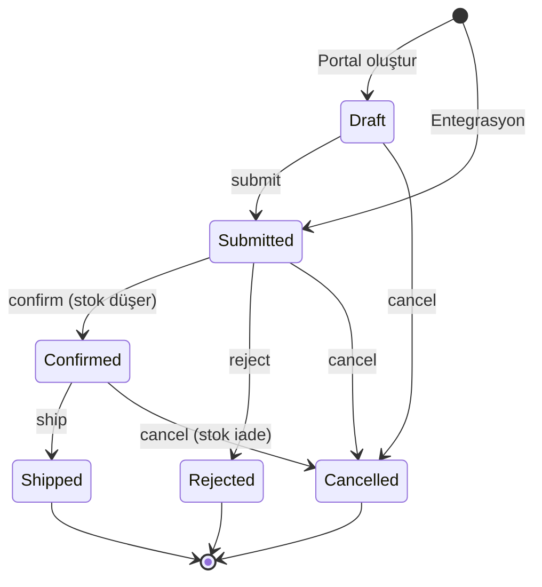
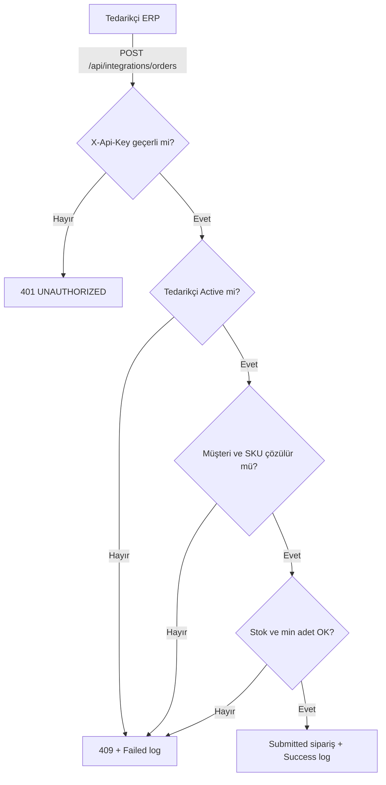
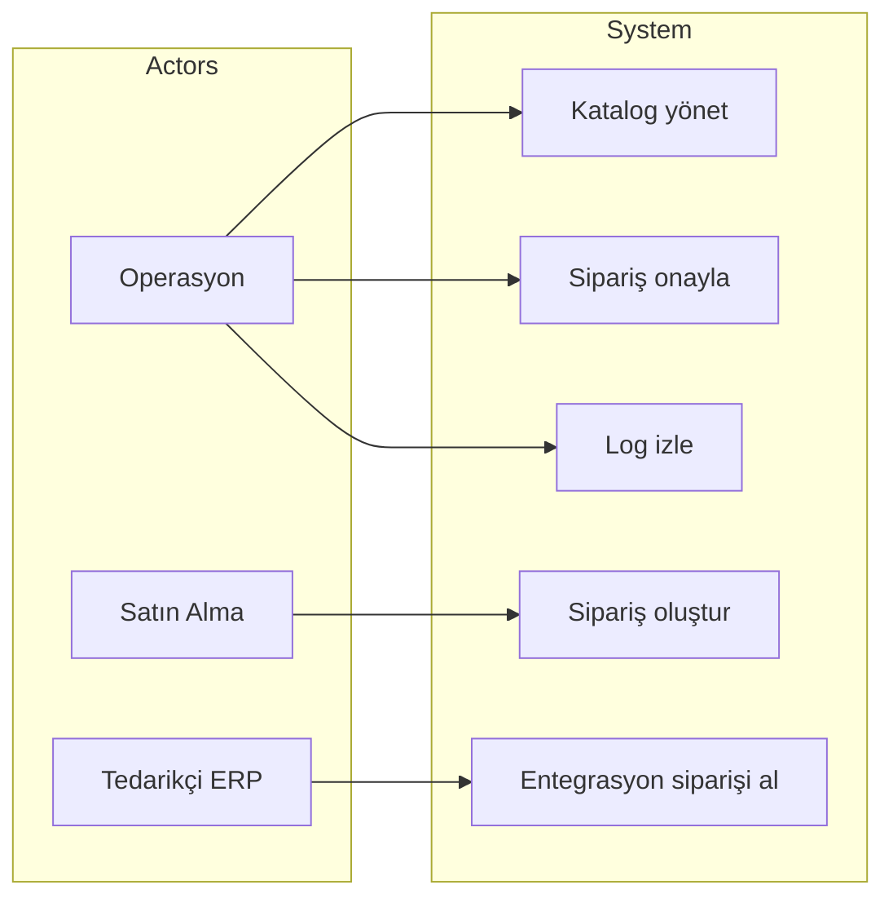
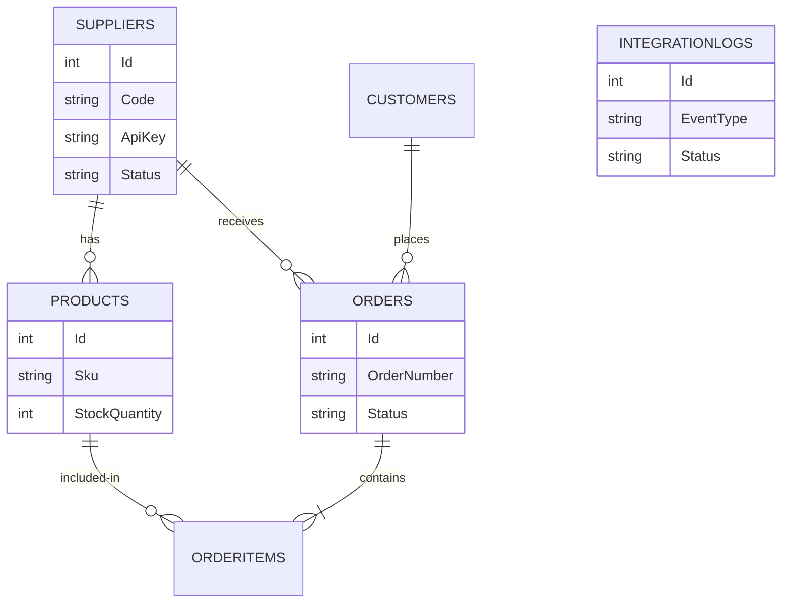

# B2B Integration & Order Management System

B2B tedarikçi, ürün ve sipariş süreçlerini destekleyen REST tabanlı entegrasyon ve sipariş yönetim sistemi. İş analizi çıktıları (BRD, FR, iş kuralları, kullanıcı akışları), ilişkisel veri modeli, UML diyagramları, Postman kabul testleri ve çalışan ASP.NET Core Web API birlikte teslim edilir.

1. [İş Problemi, Kapsam ve Değer Önerisi](#1--iş-problemi-kapsam-ve-değer-önerisi)
2. [Sipariş Karar Mimarisi & İş Kuralları](#2--sipariş-karar-mimarisi--iş-kuralları)
3. [Süreç Akışları, UML ve Entegrasyon Modellemesi](#3--süreç-akışları-uml-ve-entegrasyon-modellemesi)
4. [Veri Modelleme & İlişkisel Mimari (ERD)](#4-️-veri-modelleme--ilişkisel-mimari-erd)
5. [Agile / Scrum Yönetimi & Jira İzlenebilirliği](#5--agile--scrum-yönetimi--jira-izlenebilirliği)
6. [Admin Paneli ve Kullanıcı Akışı Arayüzü](#6-️-admin-paneli-ve-kullanıcı-akışı-arayüzü)
7. [Test Doğrulama ve Kabul Kriterleri (Postman)](#7--test-doğrulama-ve-kabul-kriterleri-postman)
8. [Hızlı Başlangıç (Mimari & Dağıtım Özeti)](#8-️-hızlı-başlangıç-mimari--dağıtım-özeti)

---

## 1. İş Problemi, Kapsam ve Değer Önerisi

### Mevcut Durum Analizi & İş Problemi (Problem Statement)

Üretici / distribütör şirketlerde tedarikçi siparişleri hâlâ e-posta, Excel ve dağınık ERP çıktılarıyla ilerler. Merkezi bir sipariş ve entegrasyon katmanı olmadığında aşağıdaki operasyonel ve finansal riskler ortaya çıkar:

* **Fazla Satış (Over-Order):** Anlık stok görünür olmadığı için mevcut adedin üzerinde sipariş onaylanır; tedarikçi taahhüdü bozulur.
* **Hatalı Master Data:** Yanlış SKU, pasif ürün veya başka tedarikçiye ait kalem siparişe girer; düzeltme maliyeti operasyona yansır.
* **Onay Gecikmesi:** Sipariş durumları (`Draft`, `Submitted`, `Confirmed`) standart olmadığı için tedarikçi teyidi takip edilemez.
* **Kör Entegrasyon:** Partner ERP’sinden gelen istekler loglanmaz; hatalı payload sessizce kaybolur veya mükerrer sipariş üretir.

```
+---------------------------------------------------------------------------------------------------+
|                                  GELENEKSEL vs. ANALİTİK ÇÖZÜM                                   |
+------------------------------------+--------------------------------------------------------------+
|  Geleneksel Yaklaşım               |  B2B Sipariş & Entegrasyon Platformu                         |
+------------------------------------+--------------------------------------------------------------+
| • E-posta / Excel sipariş          | • REST API + standart sipariş yaşam döngüsü                  |
| • Stok görünürlüğü yok             | • Min. adet ve stok kuralı sipariş anında uygulanır          |
| • Durum takibi belirsiz            | • Draft → Submitted → Confirmed → Shipped geçiş matrisi      |
| • Partner hataları izlenemez       | • X-Api-Key + IntegrationLogs (success / fail)               |
| • Operasyon IT’ye bağımlı          | • Admin paneli, iş kuralı motoru ve Postman kabul testleri   |
+------------------------------------+--------------------------------------------------------------+
```

### Analitik Çözüm ve Sağlanan Değer (Value Proposition)

Geliştirilen sistem; tedarikçi–ürün–müşteri master datasını tek kaynakta tutar, sipariş durum geçişlerini iş kurallarına bağlar ve B2B partner ERP’sinden gelen inbound siparişleri API Key ile doğrular. Stok yalnızca **onay (`Confirmed`)** anında düşer; hatalı entegrasyonlar sipariş yazmasa bile `IntegrationLogs` tablosuna kaydedilir. Böylece fazla satış, kör hata ve izlenemeyen partner trafiği ortadan kalkar.

**Kapsam (v1):** tedarikçi/ürün kataloğu, sipariş yaşam döngüsü, stok ve min. adet kuralları, inbound REST entegrasyonu, entegrasyon logları, admin paneli ekranları.

**Kapsam dışı (v1):** ödeme / faturalama, kargo takip numarası, çoklu kur servisi, stok webhook’u (v2).

---

## 2. Sipariş Karar Mimarisi & İş Kuralları

Sistem, iş analistlerinin sipariş kararlarını standart bir mantıkla tanımlayabilmesi için durum makinesi + kural tablosu yaklaşımını uygular. Stok rezervasyonu onay anına kadar ertelenir; geçersiz geçişler HTTP 409 ile reddedilir.

```
                  ┌────────────────────────────────────────────────────────┐
                  │              GELEN SİPARİŞ BAĞLAMI                     │
                  │  (Müşteri, Tedarikçi, SKU, Adet, Kaynak: Portal/ERP)   │
                  └───────────────────────────┬────────────────────────────┘
                                              │
                                              ▼
                  ┌────────────────────────────────────────────────────────┐
                  │            İŞ KURALI MOTORU (AND ZİNCİRİ)              │
                  │  Active tedarikçi / müşteri, ürün eşleşmesi, min adet, │
                  │  stok yeterliliği, API Key (yalnızca entegrasyon)      │
                  └───────────────────────────┬────────────────────────────┘
                                              │
                     ┌────────────────────────┴────────────────────────┐
                     ▼                                                 ▼
             [ Tüm kurallar OK ]                           [ Kural ihlali ]
                     │                                                 │
                     ▼                                                 ▼
         ┌───────────────────────┐                    Standart hata JSON
         │ Sipariş oluşturulur   │                    (400 / 401 / 404 / 409)
         │ Draft veya Submitted  │                    + Failed IntegrationLog
         └───────────┬───────────┘
                     │
                     ▼
         ┌────────────────────────────────────────────────────────┐
         │          STOK KORUMASI (ONAY ANINDA DÜŞÜM)             │
         │   Confirm → StockQuantity -= Adet                      │
         │   Confirmed iptal → StockQuantity += Adet (iade)       │
         └────────────────────────────────────────────────────────┘
```

### Sipariş Durum Geçiş Matrisi

| Mevcut durum | İzinli sonraki durum | Tetikleyen aksiyon | Stok etkisi |
| :---: | :--- | :--- | :--- |
| **Draft** | Submitted, Cancelled | `submit` / `cancel` | Yok |
| **Submitted** | Confirmed, Rejected, Cancelled | `confirm` / `reject` / `cancel` | Confirm’de stok düşer |
| **Confirmed** | Shipped, Cancelled | `ship` / `cancel` | İptalde stok iade |
| **Rejected / Shipped / Cancelled** | — | — | Terminal durum |

Portal siparişi `Draft` açılır. Tedarikçi ERP’sinden gelen inbound sipariş doğrudan `Submitted` statüsünde oluşturulur (`Source = Integration`).

### İş Kuralı Kataloğu

| ID | Kural | Hata kodu | HTTP |
| :---: | :--- | :--- | :---: |
| **BR-01** | Tedarikçi kodu ve vergi numarası tekildir | `DUPLICATE_CODE`, `DUPLICATE_TAX_NUMBER` | 409 |
| **BR-02** | SKU tekildir | `DUPLICATE_SKU` | 409 |
| **BR-03** | Yalnızca `Active` tedarikçiye ürün eklenir | `SUPPLIER_INACTIVE` | 409 |
| **BR-04** | Yalnızca `Active` tedarikçiden sipariş alınır | `SUPPLIER_INACTIVE` | 409 |
| **BR-05** | Yalnızca `Active` müşteri sipariş açabilir | `CUSTOMER_INACTIVE` | 409 |
| **BR-06** | Kalem, seçilen tedarikçinin ürünü olmalıdır | `PRODUCT_SUPPLIER_MISMATCH` | 409 |
| **BR-07** | `Inactive` / `Discontinued` ürün sipariş edilemez | `PRODUCT_INACTIVE` | 409 |
| **BR-08** | Adet, `MinOrderQuantity` altında olamaz | `VALIDATION_ERROR` | 400 |
| **BR-09** | Adet, mevcut stoktan büyük olamaz | `STOCK_INSUFFICIENT` | 409 |
| **BR-10** | Siparişte en az bir kalem olmalıdır | `VALIDATION_ERROR` | 400 |
| **BR-11** | Sipariş numarası `ORD-yyyyMMdd-####` ve tekildir | sistem | — |
| **BR-12** | Durum geçişleri matrise uymalıdır | `INVALID_STATUS_TRANSITION` | 409 |
| **BR-13** | Stok yalnızca `Confirmed` anında düşülür | sistem | — |
| **BR-14** | `Confirmed` iptalinde stok iade edilir | sistem | — |
| **BR-15** | Entegrasyon isteği API Key olmadan kabul edilmez | `UNAUTHORIZED` | 401 |
| **BR-16** | Başarısız entegrasyon da loglanır | sistem | — |

### Standart Hata Sözleşmesi

```json
{
  "code": "STOCK_INSUFFICIENT",
  "message": "Ürün stok miktarı yetersiz.",
  "details": { "sku": "NRD-CBL-220", "requested": 50, "available": 8 }
}
```

---

## 3. Süreç Akışları, UML ve Entegrasyon Modellemesi

Süreçler durum diyagramı, entegrasyon iş akışı, use case ve ERD ile modellenmiştir. Kaynak diyagramlar: `docs/08-uml-diyagramlari.md`.

### Portal ve Entegrasyon Sipariş Süreci

```
[Satın Alma / Portal]                 [Tedarikçi ERP]
         │                                    │
         │ POST /api/orders                   │ POST /api/integrations/orders
         │ (Draft)                            │ X-Api-Key
         ▼                                    ▼
              ┌─────────── İş Kuralı Motoru ───────────┐
              │  Active kayıt, SKU, min adet, stok     │
              └──────────────────┬─────────────────────┘
                                 │
                    ┌────────────┴────────────┐
                    ▼                         ▼
              (Kurallar OK)             (Kural ihlali)
                    │                         │
                    ▼                         ▼
         [Draft / Submitted]          [400/401/404/409]
                    │                 [Failed log]
                    ▼
         Operasyon: submit → confirm (stok düşer) → ship
                    │
                    ▼
              [Nihai sipariş kaydı]
```

### Sipariş Durum Diyagramı



### B2B Inbound Entegrasyon Akışı



### Use Case



---

## 4. Veri Modelleme & İlişkisel Mimari (ERD)

İş kurallarının sürdürülebilir ve ilişkisel bütünlük içinde saklanması için 3. Normal Formda (3NF) tasarlanmış 6 ana tablo bulunmaktadır. DDL: `database/01-schema.sql`.



### Tablo Sorumlulukları ve İlişki Matrisi

| Varlık / Tablo | Açıklama | İlişkiler |
| :--- | :--- | :--- |
| **`Suppliers`** | Tedarikçi master data, vergi no, durum ve entegrasyon `ApiKey` değerini tutar. | `1 - N` ➔ `Products` `1 - N` ➔ `Orders` |
| **`Products`** | SKU, kategori, birim fiyat, stok ve min. sipariş adedini yönetir. | `N - 1` ➔ `Suppliers` `1 - N` ➔ `OrderItems` |
| **`Customers`** | Sipariş veren B2B müşteri kodu ve aktiflik durumunu saklar. | `1 - N` ➔ `Orders` |
| **`Orders`** | Sipariş numarası, kaynak (`Portal` / `Integration`), durum ve tutarı tutar. | `N - 1` ➔ `Customers` `N - 1` ➔ `Suppliers` `1 - N` ➔ `OrderItems` |
| **`OrderItems`** | Kalem adedi, birim fiyat ve satır tutarını saklar. | `N - 1` ➔ `Orders` `N - 1` ➔ `Products` |
| **`IntegrationLogs`** | Inbound istek payload’ı, referans no, success/fail ve hata mesajını kaydeder. | bağımsız olay tablosu |

**Kısıtlar:** `Suppliers.Code`, `TaxNumber`, `ApiKey`; `Products.Sku`; `Customers.Code`; `Orders.OrderNumber` alanları unique’tir. Tedarikçi silinince ürün/sipariş Restrict ile korunur.

---

## 5. Agile / Scrum Yönetimi & Jira İzlenebilirliği

Proje, kurumsal Agile/Scrum çerçevesinde **57 Story Point** iş yüküyle planlanmış; gereksinimler Epic, User Story ve Gherkin BDD formatında kabul kriterlerine dönüştürülmüştür. Backlog: `docs/09-jira-backlog.md`.

| Key | Tip | Özet | Epic | Story Point |
| :---: | :--- | :--- | :---: | :---: |
| **B2B-1** | Story | Tedarikçi CRUD ve unique kod / vergi no | E1 Katalog | 5 |
| **B2B-2** | Story | Ürün kataloğu ve stok alanları | E1 Katalog | 5 |
| **B2B-3** | Story | Taslak sipariş oluşturma | E2 Sipariş | 8 |
| **B2B-4** | Story | Durum geçişleri (submit / confirm / ship / cancel) | E2 Sipariş | 8 |
| **B2B-5** | Story | Stok rezervasyonu onay anında | E2 Sipariş | 5 |
| **B2B-6** | Story | API Key ile inbound sipariş | E3 Entegrasyon | 8 |
| **B2B-7** | Story | Integration log listesi | E3 Entegrasyon | 3 |
| **B2B-8** | Task | Postman happy path + hata senaryoları | E3 Entegrasyon | 5 |
| **B2B-9** | Task | BRD, FR, iş kuralları, UML | E4 Analiz | 5 |
| **B2B-10** | Task | Admin paneli ekran tasarımları | E4 Analiz | 5 |

### Örnek User Story & Gherkin Kabul Kriterleri (BDD)

```gherkin
Feature: Sipariş onayı ve stok koruması
  As an Operations Specialist
  I want stock to decrease only when an order is confirmed
  So that we never oversell supplier inventory.

  Scenario: Submitted sipariş onaylandığında stok düşer
    Given Ürün SKU "NRD-MTR-001" için stok adedi 40'tır
    And Sipariş durumu "Submitted" olarak belirlenmiştir
    And Sipariş kalemi 1 adet motordur
    When Operasyon siparişi onayladığında
    Then Sipariş durumu "Confirmed" olmalıdır
    And Stok adedi 39 olmalıdır
    And HTTP yanıt kodu 200 dönmelidir

  Scenario: Stok yetersizken sipariş oluşturulamaz
    Given Ürün SKU "NRD-CBL-220" için stok adedi 8'dir
    And Minimum sipariş adedi 10'dur
    When 50 adet kablo için sipariş oluşturulmak istendiğinde
    Then Sistem "STOCK_INSUFFICIENT" hatası üretmelidir
    And HTTP yanıt kodu 409 dönmelidir
    And Sipariş kaydı oluşmamalıdır
```

---

## 6. Admin Paneli ve Kullanıcı Akışı Arayüzü

Operasyon ve satın alma ekiplerinin IT desteğine ihtiyaç duymadan kataloğu, siparişleri ve entegrasyon loglarını izleyebilmesi için admin konsolu tasarlanmıştır. Ekranlar: `ui-mockups/index.html`.

### Dashboard — Operasyon Özeti
Aktif tedarikçi, bekleyen / onaylı sipariş ve başarısız entegrasyon KPI’larının tek bakışta görüldüğü özet ekran. Sipariş akışı (Taslak → Gönderildi → Onay/Red → Sevkiyat) süreç kuralını görünür kılar.

### Tedarikçiler
Master data tablosu: kod, firma, şehir ve `Active` / `Inactive` durumu. Pasif tedarikçi yeni ürüne ve yeni siparişe kapatılır.

### Ürün Kataloğu
SKU, tedarikçi, stok, min. sipariş adedi ve `Discontinued` işaretinin izlendiği katalog. Kritik stok (ör. kablo stok 8 / min 10) operasyona erken uyarı verir.

### Siparişler
Portal ve Integration kaynaklı siparişlerin durum bazlı listesi (`Draft`, `Submitted`, `Confirmed`). Operasyon bu ekrandan onay / red / sevkiyat kararını verir.

### Entegrasyon Logları
Inbound `CreateOrder` olaylarının success / fail dökümü. Partner ERP hataları (ör. bilinmeyen müşteri kodu) sipariş yazılmasa bile burada izlenir.

---

## 7. Test Doğrulama ve Kabul Kriterleri (Postman)

Sistem kalitesi ve iş kurallarının doğruluğu, **Postman Collection Runner** ile uçtan uca test edilmiştir.

* Koleksiyon: `postman/B2B-Order-Management.postman_collection.json`
* Ortam: `postman/B2B-Local.postman_environment.json`
* Demo API Key: `sup-nordic-demo-key-2026`

### Postman Test Senaryoları Matrisi

| Test Case | Senaryo / Kapsam | Gönderilen Bağlam | Beklenen Davranış & Doğrulama | Sonuç |
| :---: | :--- | :--- | :--- | :---: |
| **TC-01** | Tedarikçi listesi | `GET /api/suppliers` | HTTP 200, kayıt sayısı ≥ 3 | PASS |
| **TC-02** | Mükerrer tedarikçi kodu | `code: SUP-NORDIC` | HTTP 409, `DUPLICATE_CODE` | PASS |
| **TC-03** | Olmayan ürün | `GET /api/products/99999` | HTTP 404, `NOT_FOUND` | PASS |
| **TC-04** | Pasif tedarikçiye ürün | `supplierId: SUP-EGE` | HTTP 409, `SUPPLIER_INACTIVE` | PASS |
| **TC-05** | Taslak sipariş | 1 adet motor, aktif müşteri | HTTP 201, `status: Draft` | PASS |
| **TC-06** | Min. adet altı sipariş | Kablo adet = 1 (min 10) | HTTP 400, validasyon hatası | PASS |
| **TC-07** | Stok üstü sipariş | Kablo adet = 50 (stok 8) | HTTP 409, `STOCK_INSUFFICIENT` | PASS |
| **TC-08** | Durum akışı | Draft → submit → confirm | HTTP 200, stok azalır | PASS |
| **TC-09** | Geçersiz geçiş | Shipped siparişi iptal | HTTP 409, `INVALID_STATUS_TRANSITION` | PASS |
| **TC-10** | API Key yok | Header gönderilmez | HTTP 401, `UNAUTHORIZED` | PASS |
| **TC-11** | Hatalı API Key | `X-Api-Key: wrong-key` | HTTP 401 | PASS |
| **TC-12** | Geçerli entegrasyon | `CUS-METAL` + `NRD-SNS-014` x 10 | HTTP 201, `Submitted`, `Source=Integration` | PASS |
| **TC-13** | Bilinmeyen müşteri | `customerCode: CUS-UNKNOWN` | HTTP 404 + Failed log | PASS |

> **Performans özeti:** Postman Runner üzerinde koşan kabul senaryolarının tamamı (13/13) LocalDB üzerinde başarıyla doğrulanmıştır. Koleksiyon assertion’ları HTTP kodu, hata kodu ve sipariş durumu alanlarını kontrol eder.

---

## 8. Hızlı Başlangıç (Mimari & Dağıtım Özeti)

### Sistem Bileşenleri

* **REST API:** ASP.NET Core Web API (.NET 10) + OpenAPI
* **ORM & Veritabanı:** Entity Framework Core + SQL Server / LocalDB
* **İş kuralları:** Servis katmanında durum makinesi + stok koruması
* **Ön yüz (mockup):** HTML5 + CSS3 admin paneli (`ui-mockups/`)
* **Test:** Postman Collection Runner (istek / yanıt / hata senaryoları)

```
Postman / Admin UI / Tedarikçi ERP
                │
              REST/JSON
                │
        ASP.NET Core Web API
                │
          EF Core + SQL Server
```

---

### Çalıştırma Adımları

```powershell
cd src/B2BOrderManagement.Api
dotnet run --launch-profile http
```

İlk açılışta LocalDB üzerinde `B2BOrderManagement` veritabanı oluşturulur ve örnek tedarikçi / ürün / sipariş verileri yüklenir.

API zaten çalışıyorsa exe kilitlenir; önce mevcut süreci kapatın, ardından komutu yeniden çalıştırın.

---

### Erişim Noktaları

* **API kökü:** [http://localhost:5187](http://localhost:5187)
* **OpenAPI:** [http://localhost:5187/openapi/v1.json](http://localhost:5187/openapi/v1.json)
* **Tedarikçiler:** [http://localhost:5187/api/suppliers](http://localhost:5187/api/suppliers)
* **Siparişler:** [http://localhost:5187/api/orders](http://localhost:5187/api/orders)
* **Entegrasyon logları:** [http://localhost:5187/api/integrations/logs](http://localhost:5187/api/integrations/logs)
* **Admin paneli:** `ui-mockups/index.html`

---

### Analiz Dokümanları

| Doküman | İçerik |
| :--- | :--- |
| `docs/01-is-gereksinimleri.md` | BRD, paydaşlar, kapsam |
| `docs/02-teknik-gereksinimler.md` | NFR, hata sözleşmesi |
| `docs/03-kullanici-akislari.md` | Portal / entegrasyon akışları |
| `docs/04-is-kurallari.md` | BR-01 … BR-16 |
| `docs/05-fonksiyonel-gereksinimler.md` | FR kataloğu |
| `docs/06-veri-modeli.md` | Varlıklar ve kısıtlar |
| `docs/07-api-tasarimi.md` | Endpoint sözleşmesi |
| `docs/08-uml-diyagramlari.md` | Durum, akış, use case, ERD |
| `docs/09-jira-backlog.md` | Epic / story / puan |
| `docs/10-test-senaryolari.md` | TC-01 … TC-13 |
| `docs/11-figma-ekranlari.md` | Admin paneli Figma aktarımı |

---

*Bu dokümantasyon, B2B Integration & Order Management System projesinin İş ve Sistem Analizi standartlarına uygunluğunu sergilemek amacıyla hazırlanmıştır.*
