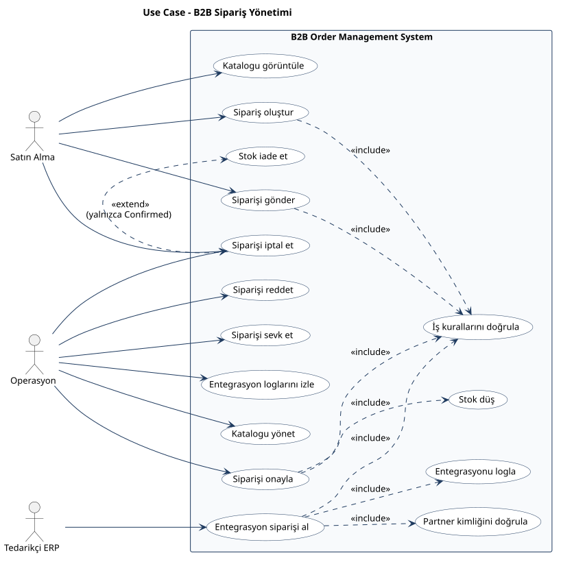
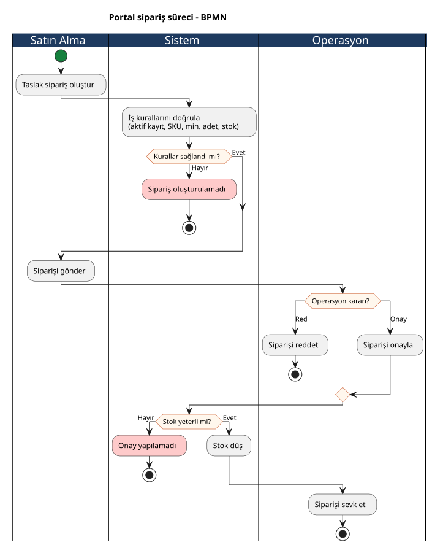
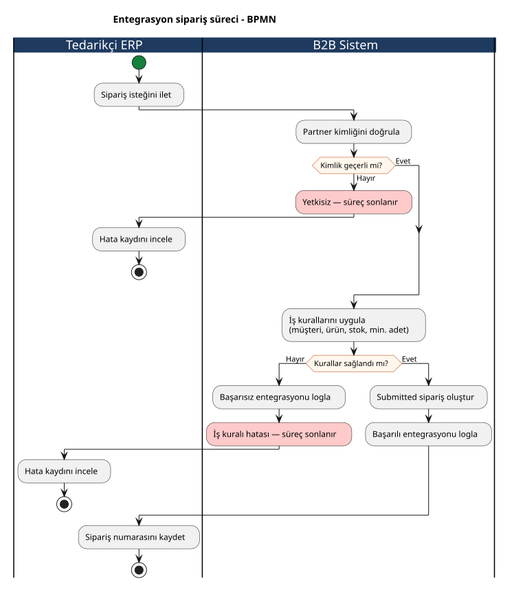
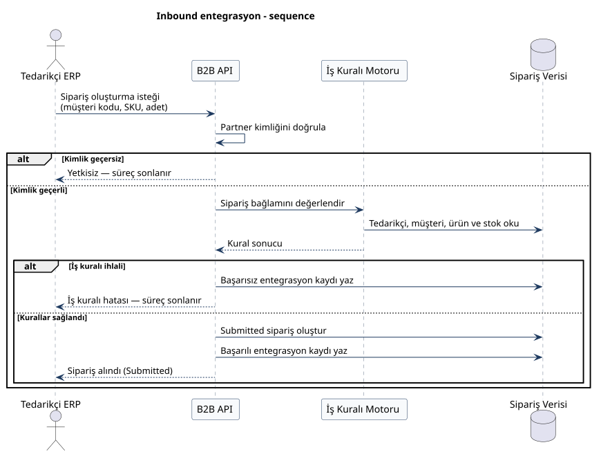
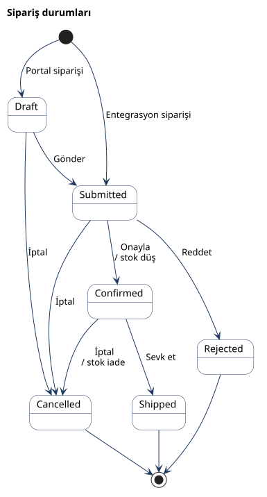
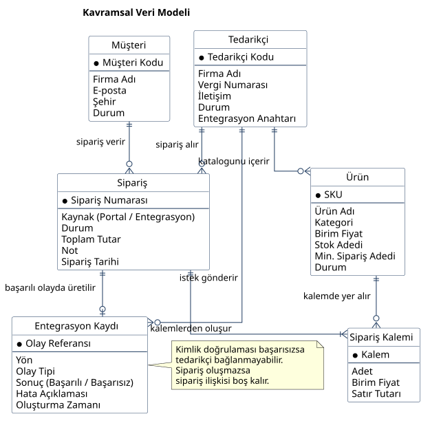

# B2B Integration & Order Management System

B2B tedarikçi, ürün ve sipariş sürecini baştan sona modellemek için hazırladığım iş analizi ve REST API projesi. Gereksinimleri, iş kurallarını, kullanıcı akışlarını ve veri modelini ben çıkardım; API’yi ASP.NET Core + SQL Server üzerinde ayağa kaldırıp Postman’da test ettim.

1. [İş problemi ve kapsam](#1--iş-problemi-ve-kapsam)
2. [Sipariş karar mimarisi ve iş kuralları](#2--sipariş-karar-mimarisi-ve-iş-kuralları)
3. [Süreç modelleme (Use Case, BPMN, Sequence)](#3--süreç-modelleme-use-case-bpmn-sequence)
4. [Kavramsal veri modeli](#4--kavramsal-veri-modeli)
5. [Jira backlog](#5--jira-backlog)
6. [Admin paneli](#6--admin-paneli)
7. [Postman testleri](#7--postman-testleri)
8. [Çalıştırma](#8--çalıştırma)

---

## 1. İş problemi ve kapsam

Siparişler e-posta ve Excel ile gidince stok güncel kalmıyor, yanlış SKU giriliyor, tedarikçi onayı takip edilemiyor. Partner ERP’den gelen istekler de bir yerde durmuyor; hata olunca kimse görmüyor.

```
+---------------------------------------------------------------------------------------------------+
|                                  E-POSTA / EXCEL vs. BU PROJE                                    |
+------------------------------------+--------------------------------------------------------------+
|  Mevcut işleyiş                    |  Bu sistem                                                   |
+------------------------------------+--------------------------------------------------------------+
| • E-posta / Excel sipariş          | • REST API + standart sipariş yaşam döngüsü                  |
| • Stok görünürlüğü yok             | • Min. adet ve stok kuralı sipariş anında uygulanır          |
| • Durum takibi belirsiz            | • Draft → Submitted → Confirmed → Shipped                    |
| • Partner hataları izlenemez       | • API Key + IntegrationLogs                                  |
| • Operasyon IT’ye bağlı            | • Admin paneli + Postman senaryoları                         |
+------------------------------------+--------------------------------------------------------------+
```

Sistemde tedarikçi, ürün ve müşteri tek yerde duruyor. Sipariş durumu iş kurallarına bağlı. ERP’den gelen sipariş API Key ile doğrulanıyor. Stoku onay anında düşürdüm; hatalı entegrasyonu da sipariş oluşmasa bile log’a yazıyorum.

**Bu sürümde var:** katalog, sipariş akışı, stok / min. adet kuralları, inbound entegrasyon, log, admin ekranları.

**Bilinçli olarak bırakmadım:** ödeme, kargo takip no, kur servisi, stok webhook’u.

---

## 2. Sipariş karar mimarisi ve iş kuralları

Siparişi durum makinesi + kural tablosuyla bağladım. Stoku taslakta rezerve etmiyorum; onay gelene kadar dokunmuyorum. Matrise uymayan geçişi 409 ile kesiyorum.

```
                  ┌────────────────────────────────────────────────────────┐
                  │              GELEN SİPARİŞ BAĞLAMI                     │
                  │  (Müşteri, Tedarikçi, SKU, Adet, Kaynak: Portal/ERP)   │
                  └───────────────────────────┬────────────────────────────┘
                                              │
                                              ▼
                  ┌────────────────────────────────────────────────────────┐
                  │            İŞ KURALI MOTORU (AND ZİNCİRİ)              │
                  │  Active tedarikçi / müşteri, ürün eşleşmesi, min adet, │
                  │  stok yeterliliği, API Key (yalnızca entegrasyon)      │
                  └───────────────────────────┬────────────────────────────┘
                                              │
                     ┌────────────────────────┴────────────────────────┐
                     ▼                                                 ▼
             [ Tüm kurallar OK ]                           [ Kural ihlali ]
                     │                                                 │
                     ▼                                                 ▼
         ┌───────────────────────┐                    Standart hata JSON
         │ Sipariş oluşturulur   │                    (400 / 401 / 404 / 409)
         │ Draft veya Submitted  │                    + Failed IntegrationLog
         └───────────┬───────────┘
                     │
                     ▼
         ┌────────────────────────────────────────────────────────┐
         │          STOK KORUMASI (ONAY ANINDA DÜŞÜM)             │
         │   Confirm → StockQuantity -= Adet                      │
         │   Confirmed iptal → StockQuantity += Adet (iade)       │
         └────────────────────────────────────────────────────────┘
```

### Sipariş Durum Geçiş Matrisi

| Mevcut durum | İzinli sonraki durum | Tetikleyen aksiyon | Stok etkisi |
| :---: | :--- | :--- | :--- |
| **Draft** | Submitted, Cancelled | `submit` / `cancel` | Yok |
| **Submitted** | Confirmed, Rejected, Cancelled | `confirm` / `reject` / `cancel` | Confirm’de stok düşer |
| **Confirmed** | Shipped, Cancelled | `ship` / `cancel` | İptalde stok iade |
| **Rejected / Shipped / Cancelled** | — | — | Terminal durum |

Portal siparişi `Draft` açılır. Tedarikçi ERP’sinden gelen inbound sipariş doğrudan `Submitted` statüsünde oluşturulur (`Source = Integration`).

### İş Kuralı Kataloğu

| ID | Kural | Hata kodu | HTTP |
| :---: | :--- | :--- | :---: |
| **BR-01** | Tedarikçi kodu ve vergi numarası tekildir | `DUPLICATE_CODE`, `DUPLICATE_TAX_NUMBER` | 409 |
| **BR-02** | SKU tekildir | `DUPLICATE_SKU` | 409 |
| **BR-03** | Yalnızca `Active` tedarikçiye ürün eklenir | `SUPPLIER_INACTIVE` | 409 |
| **BR-04** | Yalnızca `Active` tedarikçiden sipariş alınır | `SUPPLIER_INACTIVE` | 409 |
| **BR-05** | Yalnızca `Active` müşteri sipariş açabilir | `CUSTOMER_INACTIVE` | 409 |
| **BR-06** | Kalem, seçilen tedarikçinin ürünü olmalıdır | `PRODUCT_SUPPLIER_MISMATCH` | 409 |
| **BR-07** | `Inactive` / `Discontinued` ürün sipariş edilemez | `PRODUCT_INACTIVE` | 409 |
| **BR-08** | Adet, `MinOrderQuantity` altında olamaz | `VALIDATION_ERROR` | 400 |
| **BR-09** | Adet, mevcut stoktan büyük olamaz | `STOCK_INSUFFICIENT` | 409 |
| **BR-10** | Siparişte en az bir kalem olmalıdır | `VALIDATION_ERROR` | 400 |
| **BR-11** | Sipariş numarası `ORD-yyyyMMdd-####` ve tekildir | sistem | — |
| **BR-12** | Durum geçişleri matrise uymalıdır | `INVALID_STATUS_TRANSITION` | 409 |
| **BR-13** | Stok yalnızca `Confirmed` anında düşülür | sistem | — |
| **BR-14** | `Confirmed` iptalinde stok iade edilir | sistem | — |
| **BR-15** | Entegrasyon isteği API Key olmadan kabul edilmez | `UNAUTHORIZED` | 401 |
| **BR-16** | Başarısız entegrasyon da loglanır | sistem | — |

### Standart Hata Sözleşmesi

```json
{
  "code": "STOCK_INSUFFICIENT",
  "message": "Ürün stok miktarı yetersiz.",
  "details": { "sku": "NRD-CBL-220", "requested": 50, "available": 8 }
}
```

---

## 3. Süreç modelleme (Use Case, BPMN, Sequence)

Diyagramları UML ve BPMN notasyonuyla çizdim. Kaynaklar `docs/08-uml-diyagramlari.md` ve `docs/diagrams/` altında.

### Use Case

Aktörler sistem dışında, senaryolar oval. Ortak kontrolleri `<<include>>` ile bağladım. Confirmed sipariş iptalinde stok iadesi `<<extend>>`.



### BPMN — Portal siparişi

Satın Alma, Sistem, Operasyon lane’leri. Başlangıç / bitiş event’leri ve exclusive gateway’ler var; hata yolları da End Event ile kapanıyor.



### BPMN — Entegrasyon siparişi

Tedarikçi ERP ve B2B Sistem ayrı havuz. Kimlik veya kural tutmazsa süreç orada bitiyor.



### Sequence — Inbound entegrasyon

ERP ile API arasındaki mesajlaşmayı sequence diagram’da tuttum. Path / header gibi detayı iş diline indirdim.



### Durum makinesi



---

## 4. Kavramsal veri modeli

ERD’yi iş diliyle çizdim; kutularda `int` / `string` yok. Crow’s Foot kullandım. Fiziksel tablo tipleri `database/01-schema.sql` içinde.

Entegrasyon kaydını tedarikçiye bağladım. Sipariş ancak istek gerçekten siparişe dönüşürse ilişkileniyor.



### Varlık Sorumlulukları ve İlişki Matrisi

| Varlık | İş sorumluluğu | İlişkiler |
| :--- | :--- | :--- |
| **Tedarikçi** | Partner master data, durum, entegrasyon kimliği | `1 - N` Ürün, `1 - N` Sipariş, `1 - N` Entegrasyon Kaydı |
| **Ürün** | Katalog, stok, min. sipariş adedi | `N - 1` Tedarikçi, `1 - N` Sipariş Kalemi |
| **Müşteri** | Sipariş veren B2B firma | `1 - N` Sipariş |
| **Sipariş** | Yaşam döngüsü, kaynak, tutar | `N - 1` Müşteri, `N - 1` Tedarikçi, `1 - N` Kalem, `1 - 0..1` Entegrasyon Kaydı |
| **Sipariş Kalemi** | Adet ve satır tutarı | `N - 1` Sipariş, `N - 1` Ürün |
| **Entegrasyon Kaydı** | Inbound olayın başarı / hata izi | `N - 1` Tedarikçi (opsiyonel), `N - 0..1` Sipariş |

---

## 5. Jira backlog

İşleri Epic / Story / Task olarak böldüm, tahmini efor **57 SP**. Detay: `docs/09-jira-backlog.md`.

| Key | Tip | Özet | Epic | Story Point |
| :---: | :--- | :--- | :---: | :---: |
| **B2B-1** | Story | Tedarikçi CRUD ve unique kod / vergi no | E1 Katalog | 5 |
| **B2B-2** | Story | Ürün kataloğu ve stok alanları | E1 Katalog | 5 |
| **B2B-3** | Story | Taslak sipariş oluşturma | E2 Sipariş | 8 |
| **B2B-4** | Story | Durum geçişleri (submit / confirm / ship / cancel) | E2 Sipariş | 8 |
| **B2B-5** | Story | Stok rezervasyonu onay anında | E2 Sipariş | 5 |
| **B2B-6** | Story | API Key ile inbound sipariş | E3 Entegrasyon | 8 |
| **B2B-7** | Story | Integration log listesi | E3 Entegrasyon | 3 |
| **B2B-8** | Task | Postman happy path + hata senaryoları | E3 Entegrasyon | 5 |
| **B2B-9** | Task | BRD, FR, iş kuralları, UML | E4 Analiz | 5 |
| **B2B-10** | Task | Admin paneli ekran tasarımları | E4 Analiz | 5 |

### User story / Gherkin

```gherkin
Feature: Sipariş onayı ve stok
  Operasyon uzmanı olarak stoğun yalnızca onayda düşmesini istiyorum,
  fazla satış olmasın.

  Scenario: Submitted sipariş onaylanınca stok düşer
    Given Ürün SKU "NRD-MTR-001" için stok adedi 40'tır
    And Sipariş durumu "Submitted" olarak belirlenmiştir
    And Sipariş kalemi 1 adet motordur
    When Operasyon siparişi onayladığında
    Then Sipariş durumu "Confirmed" olmalıdır
    And Stok adedi 39 olmalıdır

  Scenario: Stok yetmezken sipariş açılmaz
    Given Ürün SKU "NRD-CBL-220" için stok adedi 8'dir
    When 50 adet kablo için sipariş oluşturulmak istendiğinde
    Then Sistem "STOCK_INSUFFICIENT" hatası üretmelidir
    And HTTP 409 dönmelidir
```

---

## 6. Admin paneli

HTML mockup’ı `ui-mockups/index.html` içinde. Figma’ya aktarma notlarım: `docs/11-figma-ekranlari.md`.

### Dashboard — Operasyon Özeti
Aktif tedarikçi, bekleyen / onaylı sipariş ve başarısız entegrasyon KPI’larının tek bakışta görüldüğü özet ekran. Sipariş akışı (Taslak → Gönderildi → Onay/Red → Sevkiyat) süreç kuralını görünür kılar.

### Tedarikçiler
Master data tablosu: kod, firma, şehir ve `Active` / `Inactive` durumu. Pasif tedarikçi yeni ürüne ve yeni siparişe kapatılır.

### Ürün Kataloğu
SKU, tedarikçi, stok, min. sipariş adedi ve `Discontinued` işaretinin izlendiği katalog. Kritik stok (ör. kablo stok 8 / min 10) operasyona erken uyarı verir.

### Siparişler
Portal ve Integration kaynaklı siparişlerin durum bazlı listesi (`Draft`, `Submitted`, `Confirmed`). Operasyon bu ekrandan onay / red / sevkiyat kararını verir.

### Entegrasyon Logları
Inbound `CreateOrder` olaylarının success / fail dökümü. Partner ERP hataları (ör. bilinmeyen müşteri kodu) sipariş yazılmasa bile burada izlenir.

---

## 7. Postman testleri

Koleksiyonu Collection Runner ile koştum. 13 senaryonun hepsi geçti (happy path + 400/401/404/409).

* Koleksiyon: `postman/B2B-Order-Management.postman_collection.json`
* Ortam: `postman/B2B-Local.postman_environment.json`
* Test API Key: `sup-nordic-demo-key-2026`

### Postman Test Senaryoları Matrisi

| Test Case | Senaryo / Kapsam | Gönderilen Bağlam | Beklenen Davranış & Doğrulama | Sonuç |
| :---: | :--- | :--- | :--- | :---: |
| **TC-01** | Tedarikçi listesi | `GET /api/suppliers` | HTTP 200, kayıt sayısı ≥ 3 | PASS |
| **TC-02** | Mükerrer tedarikçi kodu | `code: SUP-NORDIC` | HTTP 409, `DUPLICATE_CODE` | PASS |
| **TC-03** | Olmayan ürün | `GET /api/products/99999` | HTTP 404, `NOT_FOUND` | PASS |
| **TC-04** | Pasif tedarikçiye ürün | `supplierId: SUP-EGE` | HTTP 409, `SUPPLIER_INACTIVE` | PASS |
| **TC-05** | Taslak sipariş | 1 adet motor, aktif müşteri | HTTP 201, `status: Draft` | PASS |
| **TC-06** | Min. adet altı sipariş | Kablo adet = 1 (min 10) | HTTP 400, validasyon hatası | PASS |
| **TC-07** | Stok üstü sipariş | Kablo adet = 50 (stok 8) | HTTP 409, `STOCK_INSUFFICIENT` | PASS |
| **TC-08** | Durum akışı | Draft → submit → confirm | HTTP 200, stok azalır | PASS |
| **TC-09** | Geçersiz geçiş | Shipped siparişi iptal | HTTP 409, `INVALID_STATUS_TRANSITION` | PASS |
| **TC-10** | API Key yok | Header gönderilmez | HTTP 401, `UNAUTHORIZED` | PASS |
| **TC-11** | Hatalı API Key | `X-Api-Key: wrong-key` | HTTP 401 | PASS |
| **TC-12** | Geçerli entegrasyon | `CUS-METAL` + `NRD-SNS-014` x 10 | HTTP 201, `Submitted`, `Source=Integration` | PASS |
| **TC-13** | Bilinmeyen müşteri | `customerCode: CUS-UNKNOWN` | HTTP 404 + Failed log | PASS |

> Postman assertion’ları status kodu, hata kodu ve sipariş durumunu kontrol ediyor.

---

## 8. Çalıştırma

### Sistem Bileşenleri

* **REST API:** ASP.NET Core Web API (.NET 10) + OpenAPI
* **ORM & Veritabanı:** Entity Framework Core + SQL Server / LocalDB
* **İş kuralları:** Servis katmanında durum makinesi + stok koruması
* **Ön yüz (mockup):** HTML5 + CSS3 admin paneli (`ui-mockups/`)
* **Test:** Postman Collection Runner (istek / yanıt / hata senaryoları)

```
Postman / Admin UI / Tedarikçi ERP
                │
              REST/JSON
                │
        ASP.NET Core Web API
                │
          EF Core + SQL Server
```

---

### Çalıştırma Adımları

```powershell
cd src/B2BOrderManagement.Api
dotnet run --launch-profile http
```

İlk açılışta LocalDB’de veritabanı ve örnek kayıtlar oluşuyor. Aynı anda ikinci `dotnet run` exe’yi kilitler; önce açık süreci kapat.

---

### Erişim Noktaları

* **API kökü:** [http://localhost:5187](http://localhost:5187)
* **OpenAPI:** [http://localhost:5187/openapi/v1.json](http://localhost:5187/openapi/v1.json)
* **Tedarikçiler:** [http://localhost:5187/api/suppliers](http://localhost:5187/api/suppliers)
* **Siparişler:** [http://localhost:5187/api/orders](http://localhost:5187/api/orders)
* **Entegrasyon logları:** [http://localhost:5187/api/integrations/logs](http://localhost:5187/api/integrations/logs)
* **Admin paneli:** `ui-mockups/index.html`

---

### Analiz Dokümanları

| Doküman | İçerik |
| :--- | :--- |
| `docs/01-is-gereksinimleri.md` | BRD, paydaşlar, kapsam |
| `docs/02-teknik-gereksinimler.md` | NFR, hata sözleşmesi |
| `docs/03-kullanici-akislari.md` | Portal / entegrasyon akışları |
| `docs/04-is-kurallari.md` | BR-01 … BR-16 |
| `docs/05-fonksiyonel-gereksinimler.md` | FR kataloğu |
| `docs/06-veri-modeli.md` | Varlıklar ve kısıtlar |
| `docs/07-api-tasarimi.md` | Endpoint sözleşmesi |
| `docs/08-uml-diyagramlari.md` | UML Use Case, BPMN 2.0, Sequence, kavramsal ERD |
| `docs/09-jira-backlog.md` | Epic / story / puan |
| `docs/10-test-senaryolari.md` | TC-01 … TC-13 |
| `docs/11-figma-ekranlari.md` | Admin paneli Figma aktarımı |
