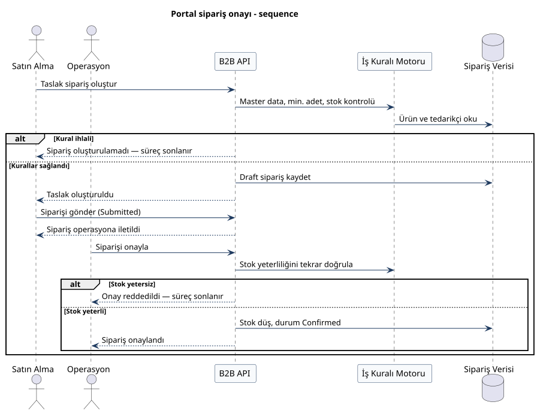

# 8. UML, BPMN ve veri modeli

Diyagramları `docs/diagrams/` altına koydum. PlantUML kaynakları `.puml`, BPMN XML `.bpmn`, görseller `.svg`.

| Diyagram | Notasyon | Dosya |
| :--- | :--- | :--- |
| Use Case | aktör + oval, include / extend | `use-case.svg` |
| Kavramsal model | Crow's Foot, iş alan adları | `conceptual-data-model.svg` |
| Portal sipariş | BPMN lane, start/end, gateway | `bpmn-portal-siparis.svg` |
| Entegrasyon | BPMN iki havuz | `bpmn-entegrasyon.svg` |
| Inbound mesajlaşma | Sequence | `sequence-entegrasyon.svg` |
| Portal onay | Sequence | `sequence-portal.svg` |
| Sipariş durumları | State machine | `state-siparis.svg` |

---

## 8.1 Use Case

Satın Alma, Operasyon ve Tedarikçi ERP sistem dışında. Ortak kural kontrolünü `<<include>>` ile bağladım. Stok iadesi sadece Confirmed iptalde `<<extend>>`.

| Aktör | Senaryolar |
| :--- | :--- |
| Satın Alma | Katalogu görüntüle, sipariş oluştur / gönder / iptal |
| Operasyon | Katalogu yönet, onay / red / sevk / iptal, log izle |
| Tedarikçi ERP | Entegrasyon siparişi al |

---

## 8.2 BPMN — Portal siparişi

Lane’ler: Satın Alma, Sistem, Operasyon. Hata yolları da bitiş event’i ile kapanıyor.

XML: `diagrams/bpmn-portal-siparis.bpmn` (Draw.io / bpmn.io)

---

## 8.3 BPMN — Entegrasyon

Tedarikçi ERP ve B2B Sistem ayrı havuz. Kimlik veya kural tutmazsa süreç orada duruyor, fail log yazılıyor.

XML: `diagrams/bpmn-entegrasyon.bpmn`

---

## 8.4 Sequence — Inbound entegrasyon

ERP → API → kural motoru → veri. HTTP path’i bu diyagramda tutmadım; iş adımı olarak yazdım.

---

## 8.5 Sequence — Portal onay

---

## 8.6 Sipariş durumları

---

## 8.7 Kavramsal veri modeli

Varlıkları iş adıyla yazdım. Entegrasyon kaydı tedarikçiye bağlı; sipariş ancak istek siparişe dönüşürse bağlanıyor.

| İlişki | Kardinalite | Kural |
| :--- | :---: | :--- |
| Tedarikçi — Ürün | 1 — 0..* | Ürün tek tedarikçiye ait |
| Tedarikçi — Sipariş | 1 — 0..* | Sipariş tek tedarikçiden |
| Müşteri — Sipariş | 1 — 0..* | Sipariş tek müşteriye ait |
| Sipariş — Sipariş Kalemi | 1 — 1..* | En az bir kalem |
| Ürün — Sipariş Kalemi | 1 — 0..* | Kalem ürüne bağlı |
| Tedarikçi — Entegrasyon Kaydı | 1 — 0..* | Kimliği çözülen istek |
| Sipariş — Entegrasyon Kaydı | 1 — 0..1 | Sadece başarılı inbound |

Tablo tipleri: `database/01-schema.sql`.
