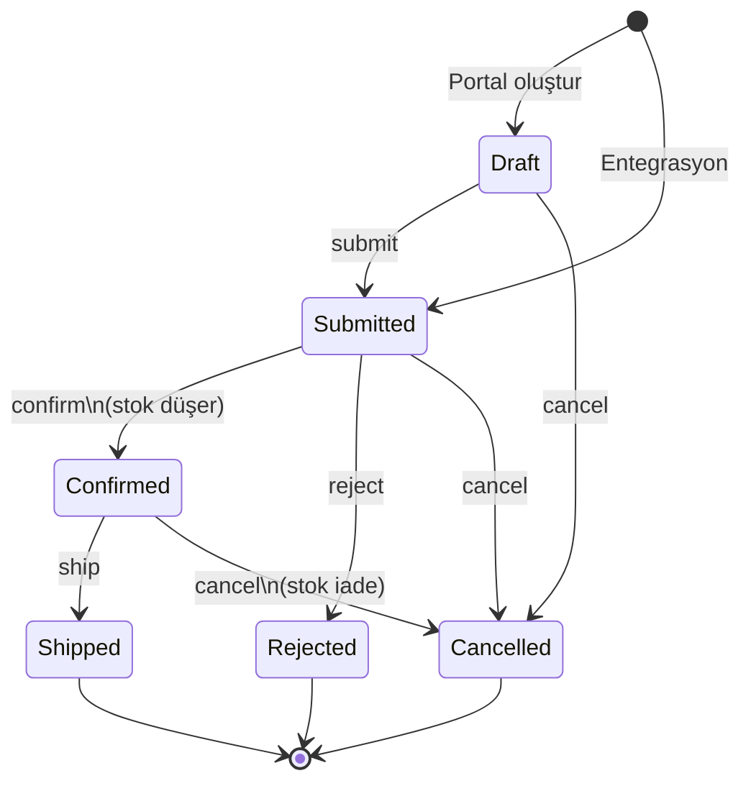
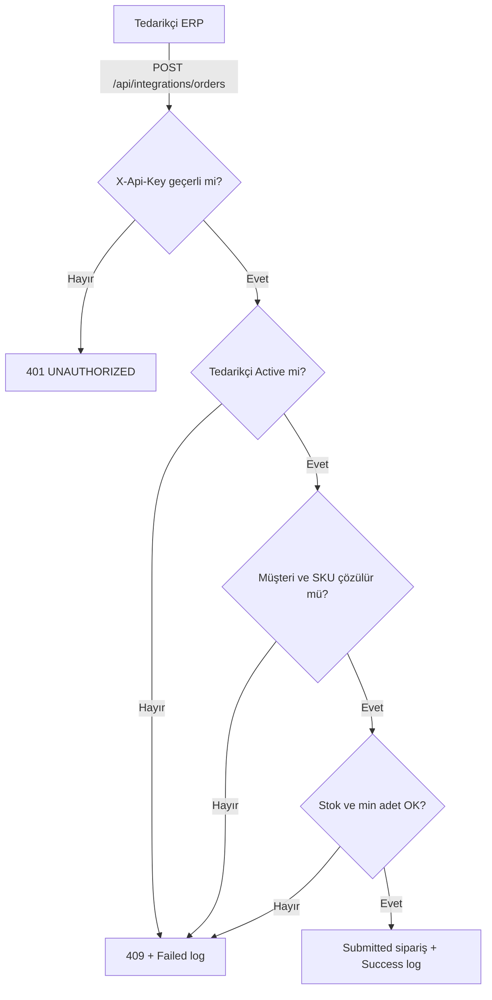
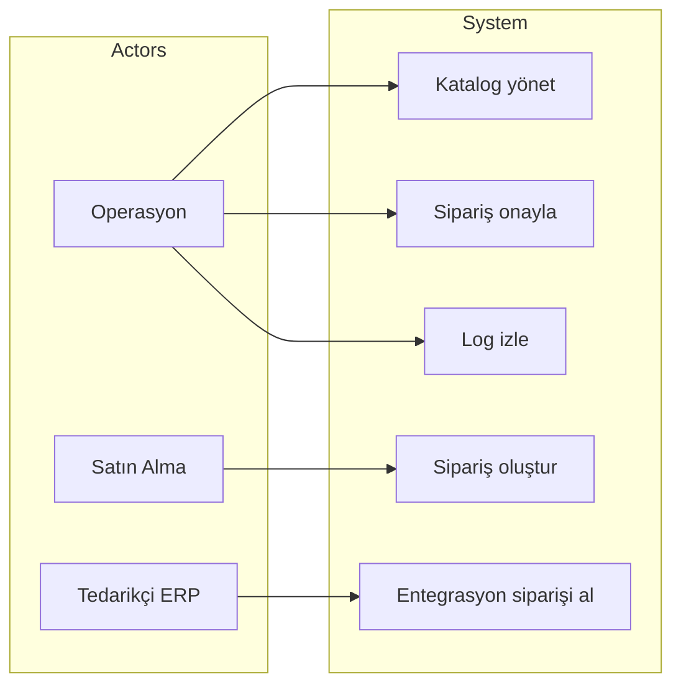
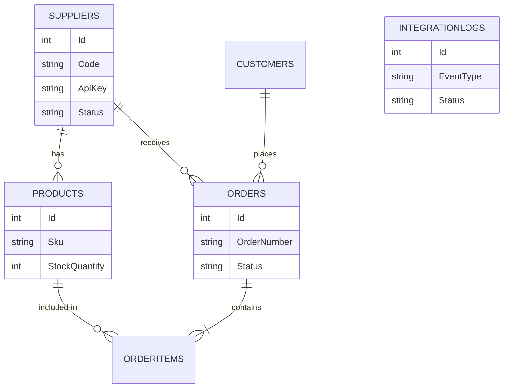

# 8. UML ve İş Akış Diyagramları

## 8.1 Sipariş durum diyagramı

```mermaid
stateDiagram-v2
    [*] --> Draft: Portal oluştur
    [*] --> Submitted: Entegrasyon
    Draft --> Submitted: submit
    Draft --> Cancelled: cancel
    Submitted --> Confirmed: confirm\n(stok düşer)
    Submitted --> Rejected: reject
    Submitted --> Cancelled: cancel
    Confirmed --> Shipped: ship
    Confirmed --> Cancelled: cancel\n(stok iade)
    Rejected --> [*]
    Shipped --> [*]
    Cancelled --> [*]
```

## 8.2 Entegrasyon iş akışı

```mermaid
flowchart TD
    A[Tedarikçi ERP] -->|POST /api/integrations/orders| B{X-Api-Key geçerli mi?}
    B -->|Hayır| C[401 UNAUTHORIZED]
    B -->|Evet| D{Tedarikçi Active mi?}
    D -->|Hayır| E[409 + Failed log]
    D -->|Evet| F{Müşteri ve SKU çözülür mü?}
    F -->|Hayır| E
    F -->|Evet| G{Stok ve min adet OK?}
    G -->|Hayır| E
    G -->|Evet| H[Submitted sipariş + Success log]
```

## 8.3 Use case

```mermaid
flowchart LR
    subgraph Actors
      OP[Operasyon]
      SA[Satın Alma]
      ERP[Tedarikçi ERP]
    end
    subgraph System
      UC1[Katalog yönet]
      UC2[Sipariş oluştur]
      UC3[Sipariş onayla]
      UC4[Entegrasyon siparişi al]
      UC5[Log izle]
    end
    SA --> UC2
    OP --> UC1
    OP --> UC3
    OP --> UC5
    ERP --> UC4
```

## 8.4 ER diyagramı

```mermaid
erDiagram
    SUPPLIERS ||--o{ PRODUCTS : has
    SUPPLIERS ||--o{ ORDERS : receives
    CUSTOMERS ||--o{ ORDERS : places
    ORDERS ||--|{ ORDERITEMS : contains
    PRODUCTS ||--o{ ORDERITEMS : included-in
    INTEGRATIONLOGS {
        int Id
        string EventType
        string Status
    }
    SUPPLIERS {
        int Id
        string Code
        string ApiKey
        string Status
    }
    PRODUCTS {
        int Id
        string Sku
        int StockQuantity
    }
    ORDERS {
        int Id
        string OrderNumber
        string Status
    }
```
